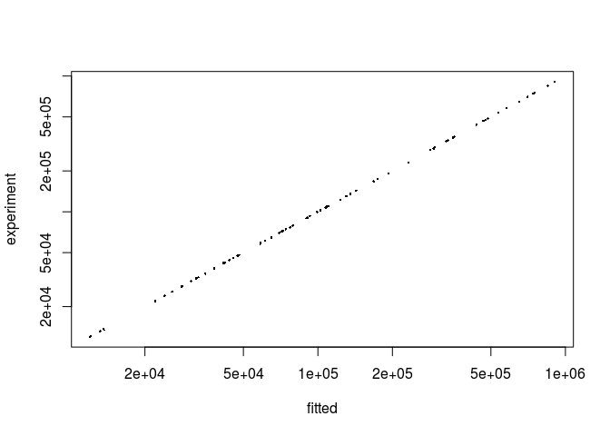

PulseR workflow
================
Alexey Uvarovskii
2017-03-23

``` r
library(pulseR)
set.seed(258)
```

Prepare a data set and conditions
---------------------------------

### The experiment description

Let us have a labelling experiment with several time points

``` r
attach(pulseRFractionData)
```

``` r
formulas <- MeanFormulas(A = a * p,
                         B =  a * b ^ time,
                         C = a * (1 - b ^ time))
```

Here is the condition matrix for our data set:

``` r
conditions
```

    ##            condition time
    ## sample_1  A_fraction    1
    ## sample_2  A_fraction    2
    ## sample_3  A_fraction    3
    ## sample_4  B_fraction    1
    ## sample_5  B_fraction    2
    ## sample_6  B_fraction    3
    ## sample_7  C_fraction    1
    ## sample_8  C_fraction    2
    ## sample_9  C_fraction    3
    ## sample_10 A_fraction    1
    ## sample_11 A_fraction    2
    ## sample_12 A_fraction    3
    ## sample_13 B_fraction    1
    ## sample_14 B_fraction    2
    ## sample_15 B_fraction    3
    ## sample_16 C_fraction    1
    ## sample_17 C_fraction    2
    ## sample_18 C_fraction    3
    ## sample_19 A_fraction    1
    ## sample_20 A_fraction    2
    ## sample_21 A_fraction    3
    ## sample_22 B_fraction    1
    ## sample_23 B_fraction    2
    ## sample_24 B_fraction    3
    ## sample_25 C_fraction    1
    ## sample_26 C_fraction    2
    ## sample_27 C_fraction    3

Create `PulseData` object
-------------------------

``` r
pd <- PulseData(
  counts = counts,
  conditions = conditions,
  formulas = formulas,
  formulaIndexes = formulaIndexes,
  groups = fractions
)
```

It is important to understand, how the data are normalised. To reduce parameter number, we use the same normalisation as in the DESeq package for samples from the *same fraction*. Strictly speaking, we define *fractions* as sets of samples, which have different amounts of RNA, estimated by the model.

### Fitting options

Now we set options for fitting. It is important to provide boundaries for the optimal parameter search:

``` r
opts <- setBoundaries(list(
  a = c(.1, 1e6),
  b = c(.01, .99),
  normFactors = c(.1, 50)
))
```

For other possible parameters please see "set" functions in the package documentation (`setBoundaries, setTolerance, setFittingOptions`).

### Initial parameter guess

Optimisation procedure may depend on the initial parameter values. A function `initParams` provides an interface to simplify this step. There are two options for how to set the parameters:

-   to sample random numbers within the given boundaries
-   manual values by the user

``` r
initPars <- list(p = pulseRFractionData$par$p)
initPars <- initParameters(initPars, c("a", "b"), pulseData = pd, options = opts)
```

Fitting
-------

One can specify other options as the number of cores or error tolerance thresholds for parameter fitting. The fitting procedure will stop, once the difference in parameters values between two subsequent iteration is less than specified in `options$tolerance`.

The function `fitModel` accepts a PulseData object, an initial guess for the parameters values and fitting options.

``` r
opts <- setTolerance(params = 1e-3,
                     normFactors = 1e-2,
                     options = opts)
result <- fitModel(pd, initPars, opts)
```

The fitted result is a list of fitted parameter values as well as fixed parameters, if they were specified.

One may compare estimations for mean read numbers derived from the fitted parameters with the raw data (simulated counts in our case):

``` r
pr <- predictExpression(result, pd)

plot(
  x = as.vector(pr$predictions),
  y = as.vector(pd$counts),
  pch = 16,
  cex = .3,
  log = 'xy',
  xlab = "fitted",
  ylab = "experiment"
  )
```



``` r
sessionInfo()
```

    ## R version 3.3.3 (2017-03-06)
    ## Platform: x86_64-pc-linux-gnu (64-bit)
    ## Running under: Ubuntu 16.04.2 LTS
    ## 
    ## locale:
    ##  [1] LC_CTYPE=en_US.UTF-8       LC_NUMERIC=C              
    ##  [3] LC_TIME=de_DE.UTF-8        LC_COLLATE=en_US.UTF-8    
    ##  [5] LC_MONETARY=de_DE.UTF-8    LC_MESSAGES=en_US.UTF-8   
    ##  [7] LC_PAPER=de_DE.UTF-8       LC_NAME=C                 
    ##  [9] LC_ADDRESS=C               LC_TELEPHONE=C            
    ## [11] LC_MEASUREMENT=de_DE.UTF-8 LC_IDENTIFICATION=C       
    ## 
    ## attached base packages:
    ## [1] graphics utils    methods  base    
    ## 
    ## other attached packages:
    ## [1] pulseR_0.0.1
    ## 
    ## loaded via a namespace (and not attached):
    ##  [1] compiler_3.3.3   backports_1.0.5  magrittr_1.5     rprojroot_1.2   
    ##  [5] tools_3.3.3      htmltools_0.3.5  yaml_2.1.14      grDevices_3.3.3 
    ##  [9] stats_3.3.3      Rcpp_0.12.9      codetools_0.2-15 stringi_1.1.2   
    ## [13] rmarkdown_1.3    knitr_1.15.1     stringr_1.1.0    digest_0.6.11   
    ## [17] evaluate_0.10
