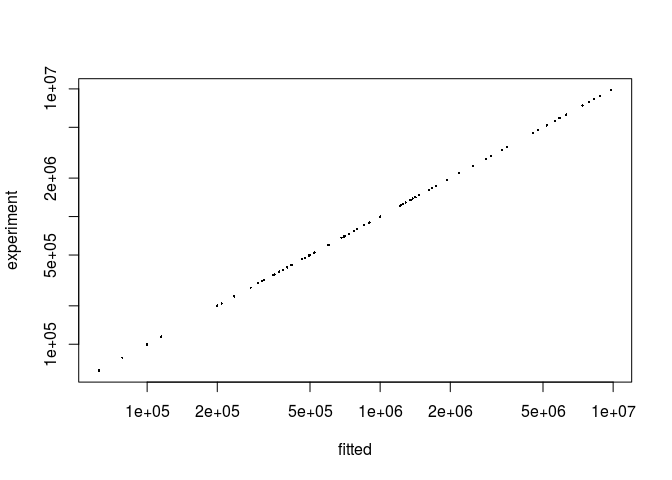

PulseR with spike-ins
================
Uvarovskii Alexey
2017-03-23

``` r
library(pulseR)
attach(pulseRSpikeinsData)
```

Prepare a data set and conditions
---------------------------------

### The experiment description

Let us have a labelling experiment with several time points

``` r
formulas <- MeanFormulas(
  A = a,
  B = a * b ^ time,
  C = alpha * a * (1 - b ^ time))

formulaIndexes <- list(
  A_fraction = 'A',
  B_fraction = c('B', 'C'),
  C_fraction = c('B', 'C'))
```

Let \(alpha\) be some parameter shared between genes and \(a\), \(b\) are the gene specific parameters.

Here is the condition matrix for our data set:

``` r
conditions
```

    ##            condition time
    ## sample_1  A_fraction    1
    ## sample_2  A_fraction    2
    ## sample_3  A_fraction    3
    ## sample_4  B_fraction    1
    ## sample_5  B_fraction    2
    ## sample_6  B_fraction    3
    ## sample_7  C_fraction    1
    ## sample_8  C_fraction    2
    ## sample_9  C_fraction    3
    ## sample_10 A_fraction    1
    ## sample_11 A_fraction    2
    ## sample_12 A_fraction    3
    ## sample_13 B_fraction    1
    ## sample_14 B_fraction    2
    ## sample_15 B_fraction    3
    ## sample_16 C_fraction    1
    ## sample_17 C_fraction    2
    ## sample_18 C_fraction    3
    ## sample_19 A_fraction    1
    ## sample_20 A_fraction    2
    ## sample_21 A_fraction    3
    ## sample_22 B_fraction    1
    ## sample_23 B_fraction    2
    ## sample_24 B_fraction    3
    ## sample_25 C_fraction    1
    ## sample_26 C_fraction    2
    ## sample_27 C_fraction    3

Spikeins in data
----------------

The count matrix consists of the read counts for genes as well as counts for the spike-ins, which are specified by row names.

``` r
counts[,1:4]
```

    ##           A_fraction A_fraction A_fraction B_fraction
    ##               100132      99843     100614     113697
    ##               200949     199742     200436     352575
    ##               299947     299812     301966     472647
    ##               402735     397831     399445     346593
    ##               503675     503351     500446     704088
    ##               597328     601121     601301     682842
    ##               697147     703352     698191     775520
    ##               797871     798010     798683    1477658
    ##               899497     898192     901346    1727296
    ##              1000624     998589     994578    1665592
    ## spikes 1        2437       2569       2379       4904
    ## spikes 2        5540       5379       5411      11085
    ## spikes 3        5252       5366       5434      11063
    ## spikes 4        9967       9900       9958      19983
    ## spikes 5        5555       5453       5520      11073
    ## spikes 6        6856       6851       6831      13617
    ## spikes 7        1329       1408       1333       2656
    ## spikes 8         240        248        256        502
    ## spikes 9        3271       3234       3174       6325
    ## spikes 10       2703       2814       2625       5432
    ## spikes 11       2599       2475       2490        226
    ## spikes 12       5357       5416       5384        521
    ## spikes 13       5486       5212       5306        535
    ## spikes 14      10137       9873       9939        968
    ## spikes 15       5457       5714       5439        544
    ## spikes 16       6922       6760       6864        695
    ## spikes 17       1455       1359       1412        143
    ## spikes 18        260        242        229         31
    ## spikes 19       3195       3205       3170        295
    ## spikes 20       2867       2688       2695        261

Since usually it is interesting to consider cross-contamination between labelled and unlabelled fractions, we need to specify spike-ins sets for these fractions. For example, the samples from the group "B\_samp" are contaminated with the "C" fraction (e.g. labelled and unlabelled). Hence, we need to provide to lists of spike-ins for the "B\_fraction" samples: for the "B" fraction and for the "C" fraction.

``` r
spikeins$spikeLists$B_fraction
```

    ## [[1]]
    ##  [1] "spikes 1"  "spikes 2"  "spikes 3"  "spikes 4"  "spikes 5" 
    ##  [6] "spikes 6"  "spikes 7"  "spikes 8"  "spikes 9"  "spikes 10"
    ## 
    ## [[2]]
    ##  [1] "spikes 11" "spikes 12" "spikes 13" "spikes 14" "spikes 15"
    ##  [6] "spikes 16" "spikes 17" "spikes 18" "spikes 19" "spikes 20"

It is very important to specify the reference group of samples, which will be used for estimation of sequencing depth correction (normally, it is the total fraction).

``` r
spikeins$refGroup
```

    ## [1] "A_fraction"

Create `PulseData` object
-------------------------

``` r
pd <- PulseData(
  counts = counts,
  conditions = conditions,
  formulas = formulas,
  formulaIndexes = formulaIndexes,
  spikeins = spikeins
)
```

### Fitting options

Now we set options for fitting. It is important to provide boundaries for the optimal parameter search:

``` r
opts <- setBoundaries(list(
  a = c(.1, 1e6),
  b = c(.01, .99),
  alpha = c(.1,10)
))
```

For other possible parameters please see "set" functions in the package documentation (`setBoundaries, setTolerance, setFittingOptions`).

### Initial parameter guess

Optimisation procedure may depend on the initial parameter values. A function `initParams` provides an interface to simplify this step. There are two options for how to set the parameters:

-   to sample random numbers within the given boundaries
-   manual values by the user

``` r
initPars <- initParameters(par = par,
                           geneParams = c("a", "b"), 
                           pulseData = pd,
                           options = opts)
```

Fitting
-------

One can specify other options like relative error tolerance thresholds for parameter fitting. The fitting procedure will stop, once the difference in parameters values between two subsequent iteration is less than specified in `options$tolerance`. For more details, see documentation for the functions `setTolerance` and `setFittingOptions`.

The function `fitModel` accepts a PulseData object, an initial guess for the parameters values and fitting options.

``` r
opts <- setTolerance(params = 1e-3,
                     normFactors = 1e-2,
                     options = opts)
result <- fitModel(pd, initPars, opts)
```

The fitted result is a list of fitted parameter values as well as fixed parameters, if they were specified.

One may compare estimations for mean read numbers derived from the fitted parameters with the raw data (simulated counts in our case):

``` r
pr <- predictExpression(result, pd)

plot(
  x = as.vector(pr$predictions),
  y = as.vector(pd$counts),
  pch = 16,
  cex = .3,
  log = 'xy',
  xlab = "fitted",
  ylab = "experiment"
)
```



``` r
sessionInfo()
```

    ## R version 3.3.3 (2017-03-06)
    ## Platform: x86_64-pc-linux-gnu (64-bit)
    ## Running under: Ubuntu 16.04.2 LTS
    ## 
    ## locale:
    ##  [1] LC_CTYPE=en_US.UTF-8       LC_NUMERIC=C              
    ##  [3] LC_TIME=de_DE.UTF-8        LC_COLLATE=en_US.UTF-8    
    ##  [5] LC_MONETARY=de_DE.UTF-8    LC_MESSAGES=en_US.UTF-8   
    ##  [7] LC_PAPER=de_DE.UTF-8       LC_NAME=C                 
    ##  [9] LC_ADDRESS=C               LC_TELEPHONE=C            
    ## [11] LC_MEASUREMENT=de_DE.UTF-8 LC_IDENTIFICATION=C       
    ## 
    ## attached base packages:
    ## [1] graphics utils    methods  base    
    ## 
    ## other attached packages:
    ## [1] pulseR_0.0.1
    ## 
    ## loaded via a namespace (and not attached):
    ##  [1] compiler_3.3.3   backports_1.0.5  magrittr_1.5     rprojroot_1.2   
    ##  [5] tools_3.3.3      htmltools_0.3.5  yaml_2.1.14      grDevices_3.3.3 
    ##  [9] stats_3.3.3      Rcpp_0.12.9      codetools_0.2-15 stringi_1.1.2   
    ## [13] rmarkdown_1.3    knitr_1.15.1     stringr_1.1.0    digest_0.6.11   
    ## [17] evaluate_0.10
