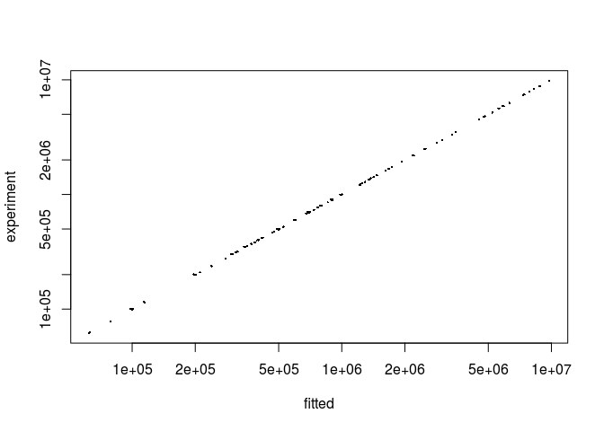

PulseR with spike-ins
================
Uvarovskii Alexey
2017-03-23

``` r
library(pulseR)
attach(pulseRSpikeinsData)
```

Prepare a data set and conditions
---------------------------------

### The experiment description

Let us have a labelling experiment with several time points

``` r
formulas <- MeanFormulas(
  A = a,
  B =  a * b ^ time,
  C = alpha * a * (1 - b ^ time))

formulaIndexes <- list(
  A_samp = 'A',
  B_samp = c('B', 'C'),
  C_samp = c('B', 'C'))
```

Let \(alpha\) be some parameter shared between genes and \(a\), \(b\) are the gene specific parameters.

Here is the condistion matrix for our data set:

``` r
conditions
```

    ##           condition time
    ## sample_1     A_samp    1
    ## sample_2     A_samp    2
    ## sample_3     A_samp    3
    ## sample_4     B_samp    1
    ## sample_5     B_samp    2
    ## sample_6     B_samp    3
    ## sample_7     C_samp    1
    ## sample_8     C_samp    2
    ## sample_9     C_samp    3
    ## sample_10    A_samp    1
    ## sample_11    A_samp    2
    ## sample_12    A_samp    3
    ## sample_13    B_samp    1
    ## sample_14    B_samp    2
    ## sample_15    B_samp    3
    ## sample_16    C_samp    1
    ## sample_17    C_samp    2
    ## sample_18    C_samp    3
    ## sample_19    A_samp    1
    ## sample_20    A_samp    2
    ## sample_21    A_samp    3
    ## sample_22    B_samp    1
    ## sample_23    B_samp    2
    ## sample_24    B_samp    3
    ## sample_25    C_samp    1
    ## sample_26    C_samp    2
    ## sample_27    C_samp    3

Spikeins in data
----------------

The count matrix consists of the read counts for the features of interest as well as counts for the spike-ins, which are specified by row names.

``` r
counts[,1:4]
```

    ##            A_samp A_samp A_samp  B_samp
    ##            100132  99843 100614  113697
    ##            200949 199742 200436  352575
    ##            299947 299812 301966  472647
    ##            402735 397831 399445  346593
    ##            503675 503351 500446  704088
    ##            597328 601121 601301  682842
    ##            697147 703352 698191  775520
    ##            797871 798010 798683 1477658
    ##            899497 898192 901346 1727296
    ##           1000624 998589 994578 1665592
    ## spikes 1     2437   2569   2379    4904
    ## spikes 2     5540   5379   5411   11085
    ## spikes 3     5252   5366   5434   11063
    ## spikes 4     9967   9900   9958   19983
    ## spikes 5     5555   5453   5520   11073
    ## spikes 6     6856   6851   6831   13617
    ## spikes 7     1329   1408   1333    2656
    ## spikes 8      240    248    256     502
    ## spikes 9     3271   3234   3174    6325
    ## spikes 10    2703   2814   2625    5432
    ## spikes 11    2599   2475   2490     226
    ## spikes 12    5357   5416   5384     521
    ## spikes 13    5486   5212   5306     535
    ## spikes 14   10137   9873   9939     968
    ## spikes 15    5457   5714   5439     544
    ## spikes 16    6922   6760   6864     695
    ## spikes 17    1455   1359   1412     143
    ## spikes 18     260    242    229      31
    ## spikes 19    3195   3205   3170     295
    ## spikes 20    2867   2688   2695     261

Since usually it is interesting to consider cross-contamination between labelled and unlabelled fractions, we need to specify spike-ins sets for these fractions. For example, the samples from the group "B\_samp" are contaminated with the "C" fraction. Hence, we need to provide to lists of spike-ins for the "B\_samp" samples: for the "B" fraction and for the "C" fraction.

``` r
spikeins$spikeLists$B_samp
```

    ## [[1]]
    ##  [1] "spikes 1"  "spikes 2"  "spikes 3"  "spikes 4"  "spikes 5" 
    ##  [6] "spikes 6"  "spikes 7"  "spikes 8"  "spikes 9"  "spikes 10"
    ## 
    ## [[2]]
    ##  [1] "spikes 11" "spikes 12" "spikes 13" "spikes 14" "spikes 15"
    ##  [6] "spikes 16" "spikes 17" "spikes 18" "spikes 19" "spikes 20"

It is very important to specify the reference group of samples, which will be used for estimation of sequencing depth correction.

``` r
spikeins$refGroup
```

    ## [1] "A_samp"

Create `PulseData` object
-------------------------

``` r
pd <- PulseData(
  counts = counts,
  conditions = conditions,
  formulas = formulas,
  formulaIndexes = formulaIndexes,
  spikeins = spikeins
)
```

### Fitting options

Now we set options for fitting. It is important to provide boundaries for the optimal parameter search:

``` r
opts <- setBoundaries(list(
  a = c(.1, 1e6),
  b = c(.01, .99),
  alpha = c(.1,10)
))
```

For other possible parameters please see "set" functions in the package documentation (`setBoundaries, setTolerance, setFittingOptions`).

### Initial parameter guess

Optimisation procedure may depend on the initial parameter values. A function `initParams` provides an intyerface to simplify this step. There are two options for how to set the parameters:

-   to sample random numbers within the given boundaries
-   manual values by the user

``` r
initPars <- initParameters(par, c("a", "b"), pulseData = pd, options = opts)
```

Fitting
-------

You can specify other options as the number of cores or error tolerance thresholds for parameter fitting. The fitting procedure will stop, once the difference in parameters values between two subsequent iteration is less than specified in `options$tolerance`.

The function `fitModel` accept the PulseData object, initial guess for the parameters values and fitting options.

``` r
opts <- setTolerance(params = 1e-3,
                     normFactors = 1e-2,
                     options = opts)
result <- fitModel(pd, initPars, opts)
```

``` r
pr <- predictExpression(result, pd)

plot(
  x = as.vector(pr$predictions),
  y = as.vector(pd$counts),
  pch = 16,
  cex = .3,
  log = 'xy',
  xlab = "fitted",
  ylab = "experiment"
)
```


